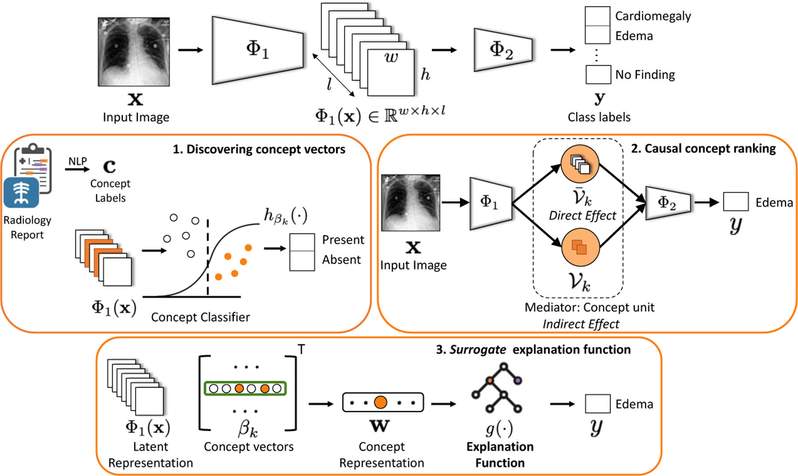
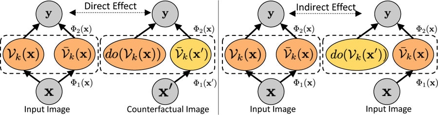
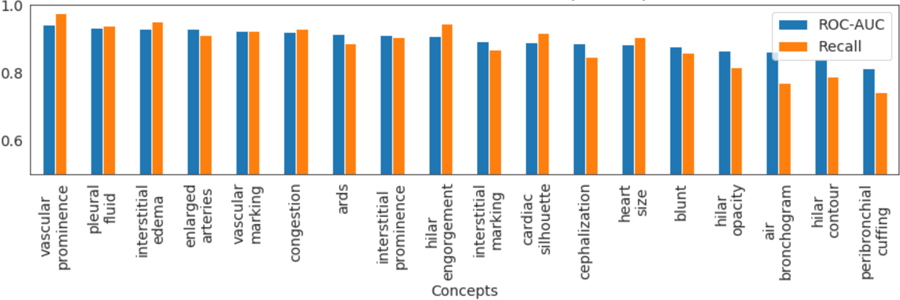
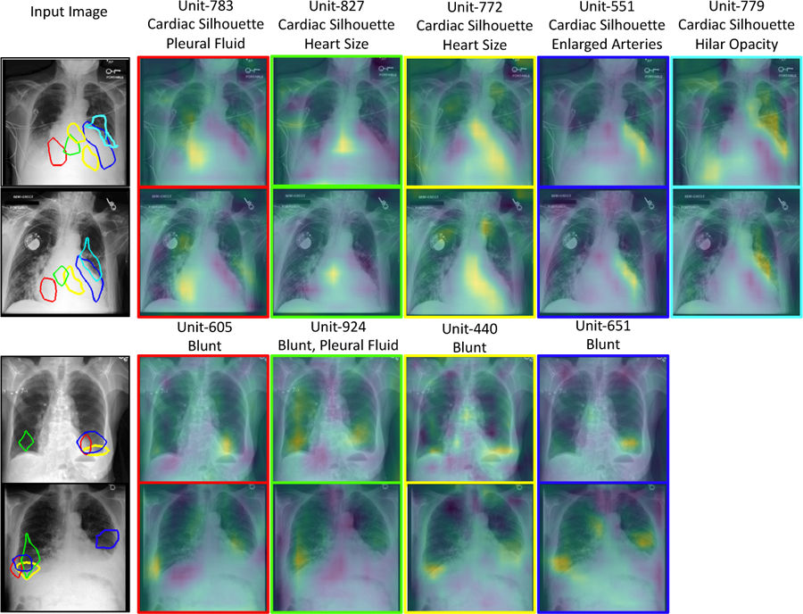
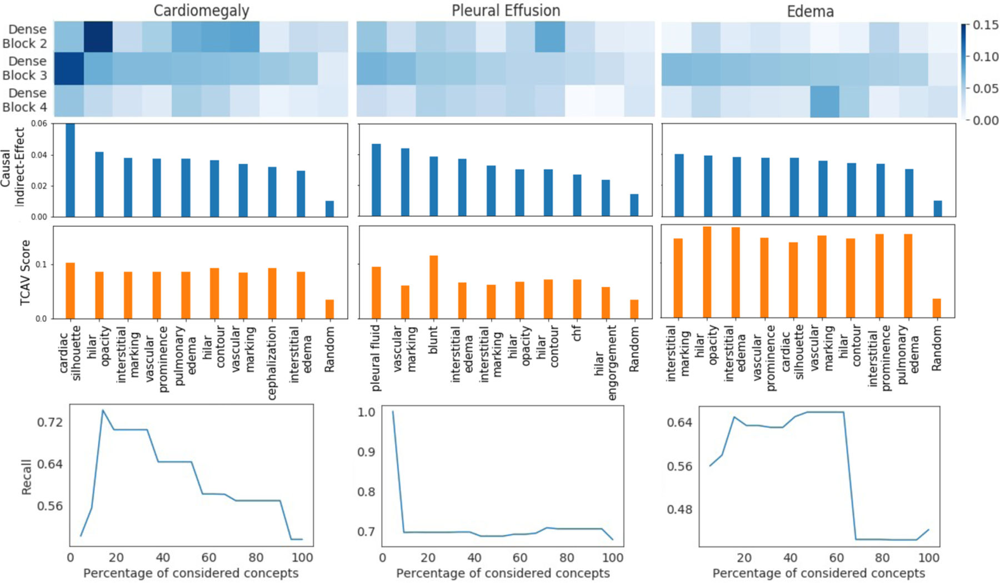
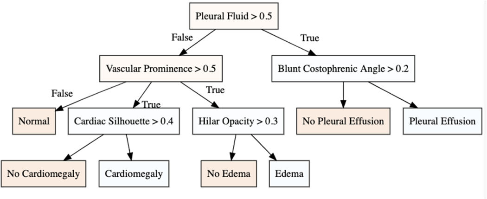

> 本文档由 PDF 自动拆分 + 多 agent 并行提取/翻译生成，原文：
> Singla, S., Wallace, S., Triantafillou, S., Batmanghelich, K.
> *Using Causal Analysis for Conceptual Deep Learning Explanation*. MICCAI 2021.
>
> - 公式以 LaTeX 给出，编号沿用原文。
> - 图片来自 PDF 嵌入图，统一存放在 `images/` 目录，文中以相对路径 `images/...` 引用。
> - 参考文献保留英文原文。

---

# 利用因果分析进行概念化深度学习解释 (Using Causal Analysis for Conceptual Deep Learning Explanation)

**Sumedha Singla¹, Stephen Wallace², Sofia Triantafillou³, Kayhan Batmanghelich³**

¹ 美国匹兹堡大学 计算机科学系
² 美国匹兹堡大学 医学院
³ 美国匹兹堡大学 生物医学信息学系

## 摘要 (Abstract)

模型可解释性（Model explainability）对于在医疗健康领域构建可信赖的机器学习模型至关重要。一个理想的解释应当类似于领域专家的决策过程，并使用临床医生有意义的概念（concept）或术语来表达。为了提供这样的解释，我们首先将分类器的隐藏单元（hidden unit）与临床相关的概念关联起来。我们利用伴随胸部 X 光图像的放射学报告来定义概念。我们使用线性稀疏逻辑回归（linear sparse logistic regression）来发现概念与隐藏单元之间的稀疏关联。为了确保所识别的单元真正影响分类器的输出，我们采用因果推断（Causal Inference）文献中的工具，更具体地说，是通过反事实干预（counterfactual interventions）的中介分析（mediation analysis）。最后，我们构建一棵低深度的决策树（decision tree），将所发现的所有概念翻译成可向放射科医生表达的简单决策规则。我们在一个大型胸部 X 光数据集上评估了我们的方法，模型产生了与临床知识一致的全局解释。

## 1 引言 (Introduction)

机器学习，特别是深度学习（Deep Learning, DL）方法，正越来越多地被应用于医疗健康领域。模型可解释性对于建立对 AI 系统的信任 [5] 以及获得临床医生的反馈至关重要。图像分类的标准解释方法通过勾勒出输入图像中对模型输出有显著贡献的区域来提供解释 [13,17,19]。然而，解释所识别区域的变化*如何*以及*为何*与模型决策相关却充满挑战。理想情况下，解释应当类似于领域专家的决策过程。本文旨在将深度学习模型的神经元激活模式映射到放射学特征，并构建一个简单的基于规则的模型，以部分地解释这一黑盒（Black-box）。

基于特征归因（feature attribution）的方法已被广泛用于解释医学影像中的深度学习模型 [1]。然而，特征归因与放射学概念之间的对齐难以实现，尤其是当一个区域可能对应多个放射学概念时。最近，研究人员关注于以人类定义的概念形式提供解释 [2,12,23]。在医学影像领域，这类方法已被用于推导乳腺 X 光摄影 [22]、乳腺组织病理学 [6] 以及心脏 MRI [4] 的解释。当前方法的一个主要缺点是它们依赖于显式的概念标注，这些标注要么是以一组代表性图像的形式 [12]，要么是以语义分割（semantic segmentation）的形式 [2] 用于学习解释。这类标注的获取代价昂贵，特别是在医疗领域。我们使用来自放射学报告的弱标注（weak annotations）来推导概念标注。此外，这些方法通过测量概念扰动与分类预测之间的相关性来量化概念的相关性。然而，神经网络可能并未使用所发现的概念来得出其决策。我们借鉴因果分析（causal analysis）文献中的工具来解决这一缺陷 [21]。

在本工作中，我们使用放射学报告中提到的放射学特征来定义概念。我们使用一个自然语言处理（Natural Language Processing, NLP）流水线，从文本中提取弱标注，并基于其阳性或阴性提及对其进行分类 [9]。接下来，我们使用稀疏逻辑回归来识别与某概念的存在相关的隐藏单元集合。为了量化所发现的概念单元（concept-unit）对模型输出的因果影响（causal influence），我们将概念单元视为处理-中介-结果（treatment-mediator-outcome）框架中的中介（mediator）[8]。利用中介分析的度量，我们基于概念对模型输出的因果相关性提供一个有效的概念排序。最后，我们构建一棵低深度决策树，将所发现的概念以简单决策规则表达，为模型提供全局解释。决策树基于规则的本质类似于临床医生的许多决策过程。

## 2 方法 (Method)

我们考虑一个预训练的黑盒（black-box）分类器 $f: \mathbf{x} \to \mathbf{y}$，它以图像 $\mathbf{x}$ 作为输入，通过一系列隐藏层处理后产生最终输出 $\mathbf{y} \in \mathbb{R}^D$。不失一般性地，我们将函数 $f$ 分解为 $\Phi_2 \circ \Phi_1(\mathbf{x})$，其中 $\Phi_1(\mathbf{x}) \in \mathbb{R}^L$ 是网络初始若干层的输出，$\Phi_2$ 表示网络的其余部分。我们假设可以访问数据集 $\mathcal{X} = \{(\mathbf{x}_n, \mathbf{y}_n, \mathbf{c}_n)\}^N$，其中 $\mathbf{x}_n$ 是输入图像，$\mathbf{y}_n$ 是类别标签的 $d$ 维独热（one-hot）编码，$\mathbf{c}_n \in \mathbb{R}^K$ 是 $k$ 维的概念标签向量。我们将概念定义为放射学报告中提到的、用于描述并为诊断提供推理依据的放射学观察结果。我们使用一个 NLP 流水线 [9] 来提取概念标注。该 NLP 流水线遵循基于规则的方法，从自由文本的放射学报告中提取并分类观察结果。所提取的第 $k$ 个概念标签 $\mathbf{c}_n[k]$ 取值为 0（阴性提及，negative-mention）、1（阳性提及，positive-mention）或 −1（不确定或缺失提及）。我们方法的概览如图 1 所示（见 Fig. 1）。我们的方法包含三个顺序步骤：

1. **概念关联（Concept associations）**：我们寻求发现概念与 $f(\cdot)$ 的隐藏单元之间的稀疏关联。我们将第 $k$ 个概念表示为一个稀疏向量 $\beta_k \in \mathbb{R}^L$，它代表中间空间 $\Phi_1(\cdot)$ 中的一个线性方向。

2. **因果概念排序（Causal concept ranking）**：使用因果推断的工具，我们基于概念与分类决策的相关性找到一个有效的概念排序。具体而言，我们将每个概念视为输入与结果之间因果路径上的中介（mediator）。我们将概念相关性度量为反事实干预对结果的影响中间接通过该概念中介所传递的部分。

3. **代理解释函数（Surrogate explanation function）**：我们学习一个易于解释的函数 $g(\cdot)$，使其在决策上模仿函数 $f(\cdot)$。利用 $g(\cdot)$，我们寻求以概念为基础学习 $f(\cdot)$ 的全局解释。

### 2.1 概念关联 (Concept associations)

我们通过学习一个将 $\Phi_1(\mathbf{x})$ 映射到概念标签的二分类器，来发现与中间表示 $\Phi_1(\cdot)$ 的概念关联 [12]。我们将每个概念视为一个独立的二分类问题，并提取一组代表性图像 $\mathcal{X}^k$，其中概念 $\mathbf{c}_n[k]$ 出现，并提取一个随机的负样本集。我们将概念向量 $\beta_k$ 定义为以下逻辑回归模型的解：

$$c_n[k] = \sigma\left(\beta_k^T \, \mathrm{vec}(\Phi_1(\mathbf{x}_n))\right) + \epsilon$$

其中 $\sigma(\cdot)$ 是 sigmoid 函数。对于卷积神经网络，$\Phi_1(\mathbf{x}) \in \mathbb{R}^{w \times h \times l}$ 是某个卷积层的输出激活，其宽度为 $w$、高度为 $h$、通道数为 $l$。我们对 $\Phi_1$ 实验了两种向量化方式。第一种，我们将 $\Phi_1(\mathbf{x})$ 展平为 $whl$ 维向量。第二种，我们沿着宽度和高度方向应用最大池化进行空间聚合，得到 $l$ 维向量。与使用线性回归的 TCAV [12] 不同，我们使用 lasso 回归以实现稀疏特征选择，并最小化以下损失函数（公式 1）：

$$\min_{\beta_k} \sum_{\mathbf{x}_n \in \mathcal{X}_k} \ell\left(h_{\beta_k}(\mathbf{x}), c_n[k]\right) + \lambda \|\beta_k\|_1$$

其中 $\ell(\cdot, \cdot)$ 是交叉熵损失，$h_{\beta_k}(\mathbf{x}) = \sigma\left(\beta_k^T \, \mathrm{vec}(\Phi_1(\mathbf{x}_n))\right)$，$\lambda$ 是正则化参数。我们采用 10 折嵌套交叉验证（10-fold nested-cross validation）来寻找误差最小的 $\lambda$。概念向量 $\beta_k$ 中的非零元素构成与第 $k$ 个概念最相关的隐藏单元集合 $\mathcal{V}_k$。

### 2.2 因果概念排序 (Causal concept ranking)

概念关联识别出与某概念强相关的隐藏单元。然而，神经网络可能使用也可能不使用所发现的概念来做出决策。我们使用因果推断的工具，量化结果中有多少比例是通过所发现的概念中介传递的。

为了实现因果推断，我们首先将反事实（counterfactual）$\mathbf{x}'$ 定义为输入图像 $\mathbf{x}$ 的一种扰动，使得分类器的决策被翻转。遵循 [20] 中提出的方法，我们使用条件生成对抗网络（conditional generative adversarial network, cGAN）来学习反事实扰动。我们以分类器的输出为条件，以确保 cGAN 学习到针对给定图像 $\mathbf{x}$ 的、特定于分类器的扰动。接下来，我们使用因果中介分析（causal mediation analysis）的理论将概念与分类结果进行因果关联。具体而言，我们将概念视为从输入 $\mathbf{x}$ 到结果 $\mathbf{y}$ 的因果路径上的中介。我们指定以下效应来量化反事实扰动的因果效应以及中介在传递该效应中的作用：

1. **平均处理效应（Average treatment effect, ATE）**：ATE 是反事实扰动导致的分类结果 $\mathbf{y}$ 的总变化量。

2. **直接效应（Direct effect, DE）**：DE 是反事实扰动中**不**经过给定中介变量的所有因果机制所产生的效应。它刻画的是输入图像被扰动后，在不考虑给定概念的情况下，分类决策直接发生的变化。

3. **间接效应（Indirect effect, IE）**：IE 是反事实扰动中由一组中介变量传导的效应。它刻画的是输入图像被扰动后，通过给定概念间接地导致分类决策发生的变化。

遵循文献 [18,21] 中的潜在结果框架（potential outcome framework），我们将平均处理效应（average treatment effect, ATE）定义为事实分类结果与反事实分类结果之间的比例差（公式 2）：

$$
\mathrm{ATE} = \mathcal{E}\!\left[\frac{f(\mathbf{x}')}{f(\mathbf{x})} - 1\right].
$$

为了通过中介变量进行因果推断，我们借用 Pearl 提出的自然直接效应与间接效应（natural direct and indirect effects）的定义 [16]（参见图 2）。我们将概念单元集合 $\mathcal{V}_k$ 视为中介变量，代表第 $k$ 个概念。我们把潜在表示 $\Phi_1(\mathbf{x})$ 分解为概念单元 $\mathcal{V}_k(\mathbf{x})$ 的响应与其余隐藏单元 $\bar{\mathcal{V}}_k(\mathbf{x})$ 的响应的拼接，即 $\Phi_1(\mathbf{x}) = \big[\mathcal{V}_k(\mathbf{x}), \bar{\mathcal{V}}_k(\mathbf{x})\big]$。于是分类结果可重写为 $f(\mathbf{x}) = \Phi_2\big(\Phi_1(\mathbf{x})\big) = \Phi_2\big([\mathcal{V}_k(\mathbf{x}), \bar{\mathcal{V}}_k(\mathbf{x})]\big)$。为了把直接效应与间接效应解耦，我们在已学网络的单元层面上使用 do-操作（do-operation）的概念。具体地，我们用 $do\big(\mathcal{V}_k(\mathbf{x})\big)$ 来表示将概念单元的取值设为以原始图像作为输入时所得到的值。通过对网络进行干预并设置概念单元的值，我们可以在保持中介变量（即 $\mathcal{V}_k$）固定为扰动前的值的同时，把直接效应计算为事实分类结果与反事实分类结果之间的比例差：

即得到直接效应（公式 3）：

$$
\mathrm{DE} = \mathcal{E}\!\left[\frac{\Phi_2\big([\,do(\mathcal{V}_k(\mathbf{x})),\,\bar{\mathcal{V}}_k(\mathbf{x}')]\big)}{\Phi_2\big([\mathcal{V}_k(\mathbf{x}),\,\bar{\mathcal{V}}_k(\mathbf{x})]\big)} - 1\right].
$$

我们把间接效应计算为：在保持其他一切固定为原值的情况下，将中介变量从原值改为反事实下取值时，分类输出的期望变化（公式 4）：

$$
\mathrm{IE} = \mathcal{E}\!\left[\frac{\Phi_2\big([\,do(\mathcal{V}_k(\mathbf{x}')),\,\bar{\mathcal{V}}_k(\mathbf{x})]\big)}{\Phi_2\big([\mathcal{V}_k(\mathbf{x}),\,\bar{\mathcal{V}}_k(\mathbf{x})]\big)} - 1\right].
$$

如果扰动对中介变量没有影响，那么因果间接效应就为零。最后，我们以一个概念所对应的间接效应作为该概念对分类决策相关性的度量。

### 2.3 替代解释函数（Surrogate explanation function）

我们的目标是学习一个替代函数（surrogate function）$g(\cdot)$，使其使用一个可解释且简单直观的函数来再现函数 $f(\cdot)$ 的输出。我们把 $g(\cdot)$ 形式化为一棵决策树（decision tree），因为许多临床决策过程都遵循基于规则的模式。我们利用 $k$ 个概念回归函数 $h_{\beta_k}(\cdot)$ 的输出来概括函数 $f(\cdot)$ 的内部状态，如下所示（公式 5）：

$$
\mathbf{w}_n = \Big[\,\mathrm{logit}\big(h_{\beta_1}(\mathbf{x}_n)\big),\;\mathrm{logit}\big(h_{\beta_2}(\mathbf{x}_n)\big),\;\cdots\Big].
$$

接着，我们拟合一棵决策树函数 $g(\cdot)$，使其模拟函数 $f(\cdot)$ 的输出（公式 6）：

$$
g^{\ast} = \arg\min_{g}\sum_{n}\mathcal{L}\big(g(\mathbf{w}_n),\,f(\mathbf{x}_n)\big),
$$

其中 $\mathcal{L}$ 是基于最小化熵以使每次分裂获得最大信息增益的分裂准则。

## 3 实验

我们首先评估了概念分类性能，并对概念单元（concept-units）进行可视化以展示其在概念定位上的有效性。接下来，我们汇总了不同概念在分类器不同层中所对应的间接效应。我们评估了基于因果贡献对概念进行排序的方案。最后，我们使用排名靠前的概念来学习一个以决策树形式呈现的替代解释函数。**数据预处理**：我们在 MIMIC-CXR [10] 数据集上进行实验，这是一个由 473K 张胸部 X 光图像和 206K 份报告组成的多模态数据集。该数据集对 14 种放射学观察结果进行了标注，其中包含 12 种病理。我们采用最先进的 DenseNet-121 [7] 架构作为分类函数 [9]。DenseNet-121 架构由四个 dense block 组成。我们尝试了三个版本的 $\Phi_1(\cdot)$，分别表示截至第二、第三和第四个 dense block 的网络。在概念标注方面，我们考虑了在被标注病理上下文中放射学报告里频繁出现的影像学特征。然后，我们使用 Stanford CheXpert [9] 来从自由文本放射学报告中抽取并分类这些观察结果。

### 3.1 概念分类器的评估

第三个 dense block 的中间表示在概念分类上始终优于其他层。在图 3 中，我们展示了不同概念分类器的测试集 ROC-AUC 与召回率（recall）指标。所有概念分类器都取得了较高的召回率，表明假阴性（type-2）误差较低。

在图 4 中，我们对与概念向量 $\mathcal{V}_k$ 相关联的隐藏单元的激活图进行了可视化。对于每个概念，我们可视化具有较大逻辑回归系数 $\beta_k$ 的隐藏单元。为了突出显示某个单元最被激活的区域，我们用所选单元激活分布的前 1% 分位数对激活图进行阈值处理 [2]。与先前工作 [3] 一致，我们观察到尽管在训练 $f$ 时并未使用概念标签，仍有若干隐藏单元自发地成为概念检测器。例如对 cardiac-silhouette（心脏轮廓），不同的隐藏单元会突出心脏的不同区域以及心脏与肺的边界。对于像 blunt costophrenic angle（钝化的肋膈角）这样的局部化概念，识别出多个相关单元，它们都聚焦于下肺叶区域。同一个隐藏单元可以与多个概念相关。图 4 中顶部的标签显示了每个隐藏单元最重要的两个概念。

### 3.2 利用解释函数评估因果概念

我们通过测量 ATE 来评估反事实干预的成功程度。较高的 ATE 值证实了由 [20] 生成的反事实图像成功地翻转了分类决策。我们在 cardiomegaly（心脏肥大）上取得了 0.97 的 ATE，在 pleural effusion（胸腔积液）上为 0.89，在 edema（水肿）上为 0.96。在图 1（热力图）中（见 images/page09_img1.png），我们展示了不同层中各概念所对应的间接效应分布。中间层在所有概念上都展现出较大的间接效应。这表明 dense block 3 中的隐藏单元在中介反事实干预效应方面发挥了重要作用。

在图 5（柱状图）中，我们基于间接效应对概念进行了排序。我们排序得到的排名靠前的概念，与临床医师在所考察的三种诊断中所关联的影像学特征 [11,14,15] 是一致的。此外，我们还使用 TCAV [12] 中的概念敏感度得分（concept sensitivity score）对每种诊断的概念进行排序。我们的间接效应方法与 TCAV 所识别出的前 10 个概念是相同的，只是顺序不同。前 3 个概念也相同，仅在排名上有微小差异。两种方法对随机概念都给出了较低的重要性分数。这证实了重要性分数的趋势不太可能是由偶然造成的。在我们的方法中，随机概念表示对概念关联（concept-association）步骤的消融。在此情形下，我们不再通过 lasso 回归来识别相关单元，而是随机选取单元。

为了定量地展示我们排序方案的有效性，我们迭代地考虑排名前 $x\%$ 的概念并重新训练解释函数 $g(\mathbf{w})$。在图 5（底部图）中，我们观察到当考虑更多概念时，分类器 $g(\cdot)$ 的召回率指标的变化情况。一开始，随着加入相关概念，真阳率（true positive rate）增加，从而获得较高的召回率。然而当较不相关的概念被纳入时，输入特征中的噪声增加，导致召回率下降。图 6 可视化了表现最佳模型所学到的决策树。

## 4 结论

我们提出了一个新颖的框架，用于为黑箱模型导出全局解释（global explanation）。我们的解释建立在临床相关概念之上，而这些概念在因果上影响着模型的决策。作为未来方向，我们计划将概念的定义扩展到包含更广泛的临床指标。

# 附录图

**图注（Fig.1）：** 方法概览：我们以"概念"（即放射学报告中所提及的影像学观察）为媒介对黑箱函数 $f(x)$ 提供解释。1）利用中间表示 $\Phi_1(x)$ 学习一个稀疏的 logistic 回归 $h_{\beta_k}(\cdot)$，用以对第 $k$ 个概念进行分类。2）$\beta_k$ 中非零系数所对应的隐含单元集合 $\mathcal{V}_k$ 充当着连接输入 $x$ 与输出 $y$ 的因果路径中的中介变量。3）学习一棵决策树函数，将概念映射到最终的类别标签。

---

**图注（Fig.2）：** 因果中介分析中直接效应与间接效应的示意图。

---

**图注（Fig.3）：** 不同概念分类器对应的 AUC-ROC 和召回率指标。

---

**图注（Fig.4）：** 对充当视觉概念检测器的隐含单元的激活图所进行的定性展示。每一列代表一个被识别为属于概念向量 $\mathcal{V}_k$ 一部分的隐含单元。上方两行对应 $k$ = cardiac-silhouette（心影），下方各行对应 $k$ = blunt costophrenic angle（肋膈角变钝）。

---

**图注（Fig.5）：** 各概念在 DenseNet-121 架构不同层上计算得到的间接效应（热力图）。基于因果相关性对各概念相对于诊断结果做出的排序（条形图）。基于 TCAV [12] 的概念敏感度得分得到的对比性排序。在使用排名前 x% 的概念训练决策树函数 $g(\cdot)$ 时，召回率随训练集合规模变化的趋势（趋势图）。

---

**图注（Fig.6）：** 在召回率指标上表现最佳的三种诊断所对应的决策树。
